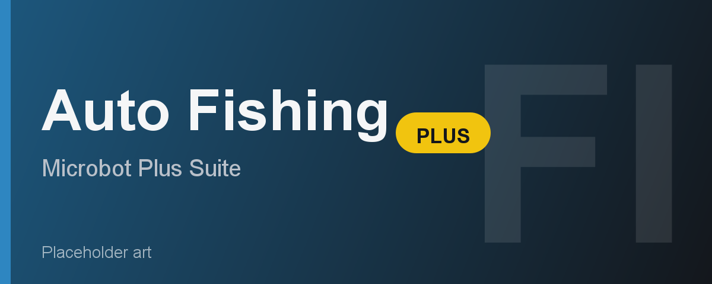

# Auto Fishing Plus

Auto Fishing Plus automates fishing across a wide range of methods and locations. It handles the full loop: walking to a spot, fishing until full, banking or dropping the catch, and returning to fish again. It is part of the Microbot "Plus" suite and shares the same stop-condition system and live stats overlay as the other Plus plugins.

---

## Feature Overview

| Feature | Description |
|---------|-------------|
| **Fish to catch** | Pick any of 20 fish types: shrimp/anchovies, trout/salmon, tuna/swordfish, lobster, shark, monkfish, anglerfish, barbarian fish, karambwan, infernal eel, sacred eel, cave eel, lava eel, dark crab, bass, cod, herring, sardine, mackerel, or pike. |
| **Location picker** | Choose a named spot (AUTO or one of eight preset locations) - the bot walks there before fishing. |
| **AUTO mode** | Fishes the nearest valid spot to where you are standing when the plugin starts; no walking needed beforehand. |
| **Banking strategy** | Each named location has its own built-in strategy: full bank, deposit box, or drop. AUTO uses the Use Bank toggle. |
| **Use Bank (AUTO only)** | When AUTO is selected, enabling this walks to the nearest full bank between loads instead of dropping the catch. |
| **Cook fish** | Optionally cooks the catch on a nearby fire or range before banking. |
| **Harpoon spec** | Choose a harpoon type for special attacks when harpooning (tuna/swordfish or shark). |
| **Stop after (minutes)** | Auto-shuts down after a set number of minutes. 0 disables the limit. |
| **Stop after (XP gained)** | Stops when the session has earned this much Fishing XP. 0 disables. |
| **Target level** | Stops when your Fishing level reaches the target, depositing or dropping the catch first. 0 disables. |
| **Stop after (fish caught)** | Stops after catching a set number of fish (counted per XP drop). 0 disables. |
| **Live overlay** | Displays current level (with level-ups gained), XP gained, XP/hr, fish caught, GP/hr estimate, runtime, target level, and ETA. |
| **Pause button** | Click Pause on the overlay to halt all scripts mid-loop without closing the plugin. |

---

## Requirements

- Microbot RuneLite client
- The correct gear in your bank or inventory for your chosen fish (see table below)
- Membership for P2P locations and fish types

| Fish | Level | Gear needed |
|------|-------|-------------|
| Shrimp / Anchovies | 1 | Small fishing net |
| Sardine / Herring / Cave eel / Pike | 5 | Fishing rod + bait |
| Big net fish (mackerel, bass, cod) | 16 | Big fishing net |
| Trout / Salmon | 20 | Fly fishing rod + feathers |
| Anglerfish | 15 | Fishing rod + sandworms |
| Harpoon fish (tuna / swordfish / shark) | 35 / 50 | Harpoon |
| Lobster | 40 | Lobster pot |
| Barbarian fish | 48 | Barbarian rod + feathers |
| Lava eel | 53 | Oily fishing rod + bait |
| Monkfish | 62 | Small fishing net |
| Karambwan | 65 | Karambwan vessel + raw karambwanji |
| Infernal eel | 80 | Oily fishing rod + bait + hammer |
| Dark crab | 85 | Lobster pot + dark fishing bait |
| Sacred eel | 87 | Fishing rod + bait + knife |

**Corsair Cove** requires completion of The Corsair Curse and Dragon Slayer I (F2P quests). The walk to the deposit box is long but free - no fare or NPC interaction.

**Fishing Guild** requires Fishing level 68.

**Piscatoris** requires Fishing level 62.

**Otto's Grotto** requires Fishing level 48 and completion of Barbarian Training.

---

## How It Works

1. Set your fish type, location, and any stop conditions in the plugin config panel.
2. Stand near the intended fishing area (for named locations the bot walks there; for AUTO stand close to the spot you want).
3. Click Start. The bot walks to the fishing spot and begins fishing.
4. When the inventory is full the bot clears it using the location's built-in strategy - banking at the nearest full bank, using a deposit box (Corsair Cove), or dropping the catch (Musa Point, Al Kharid, Otto's Grotto, and AUTO with Use Bank off).
5. The bot walks back to the fishing spot and repeats.
6. When a stop condition is reached the bot deposits or drops its current load, then shuts itself down.

---

## Configuration

**Fish to catch** and **Location** are the two settings you will always set. Make sure your chosen fish is actually available at your chosen location - if the spot finder cannot find a matching NPC it idles and the overlay shows the status.

**Banking strategy** is automatic for named locations; you do not need to change it. For AUTO you control it with the **Use Bank** toggle: off means drop, on means walk to the nearest full bank.

**Stop conditions** all default to 0 (disabled). Set any combination: the bot stops as soon as the first triggered condition is met.

**Cook fish** works only when a fire or range is within range of the fishing spot. It is off by default.

**Harpoon spec** applies only when harpooning. Leave it as NONE if you are not using a special-attack harpoon.

---

## Limitations

- AUTO with Use Bank resolves to the nearest **full bank**, so it does not suit deposit-box-only areas such as Corsair Cove. Select the named location instead when you need a deposit box.
- The GP/hr estimate on the overlay uses the GE mid price of whichever raw fish is currently in your inventory. It is an approximation and resets if the overlay cannot find a matching item price.
- Cooking support requires a fire or range to already be present at the spot; the bot does not light fires.
- The fish-type and location pairing is not validated - if you pick a fish not available at the chosen spot the bot will idle. Check the combination before starting.
- P2P locations and most fish above lobster require membership.
