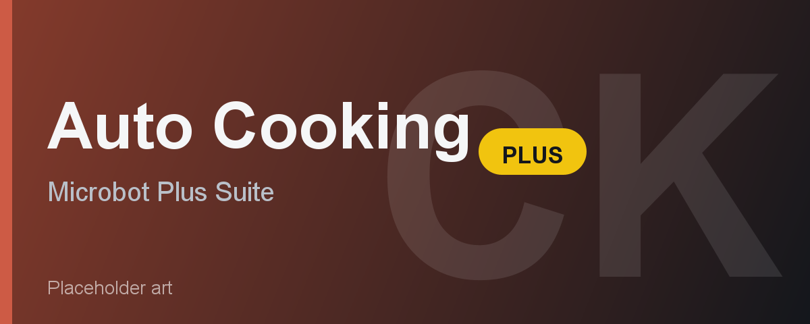

# Auto Cooking Plus

Auto Cooking Plus trains Cooking by cooking food on a range or fire and banking between loads. It handles the whole loop for you: walk to a cooking spot, cook the full inventory, drop any burnt food, bank the cooked food, withdraw a fresh load, and repeat. It is part of the Microbot "Plus" suite and shares the same stop conditions and live stats overlay as the other Plus plugins.

---

## Feature Overview

| Feature | Description |
|---------|-------------|
| **Item to cook** | Pick the raw food to cook, from raw shrimp all the way up to manta ray and the meat pies, pizzas, and cakes the base Cooking data supports. |
| **Progressive cook** | Ignores your pick and cooks the best food your Cooking level allows, re-checked each bank trip. |
| **Location** | Choose a named range or fire to cook at. Stand near a bank with a range close by for the smoothest loop. |
| **Use nearest location** | Ignores the Location pick and uses the closest valid spot for your food. |
| **Drop burnt items** | Drops burnt food before banking so it does not take up bank space. |
| **Drop order** | Sets the order burnt food is dropped in. |
| **League mode** | Presses an arrow key now and then to reset the idle logout timer. |
| **Speed mode** | Turns off Microbot antiban for a faster pace. More detectable, so throwaway accounts only. |
| **Stop after (minutes)** | Auto-shuts down after a set number of minutes. 0 disables the limit. |
| **Stop after (XP gained)** | Stops once the session has earned this much Cooking XP. 0 disables. |
| **Target level** | Stops when your Cooking level reaches the target, banking the load first. 0 disables. |
| **Stop after (cooked)** | Stops after cooking a set number of items, counted per XP drop. 0 disables. |
| **Live overlay** | Shows current level with level-ups gained, XP gained, XP/hr, items cooked, runtime, target level, and ETA. |
| **Pause button** | Click Pause on the overlay to halt the bot mid-loop without closing the plugin. |

---

## Requirements

- Microbot RuneLite client
- A stack of the raw food you want to cook in your bank
- The Cooking level for your chosen food (raw shrimp works from level 1)
- F2P friendly. Higher-level foods, some pies and pizzas, and a few locations need membership.

---

## How It Works

1. Set your food, location, and any stop conditions in the plugin config panel.
2. Put a stack of raw food in your bank and stand near your chosen range or fire (ideally next to a bank).
3. Click Start. The bot walks to the cooking spot and cooks the full inventory using the cook-all option.
4. If any food burns and Drop burnt items is on, the bot drops it.
5. The bot walks to the nearest bank, deposits the cooked food, withdraws a fresh load of raw food, and returns.
6. The loop repeats until a stop condition is hit, at which point the bot banks or drops its current load and shuts down.

---

## Configuration

**Item to cook** and **Location** are the two settings you will usually set. Turn on **Progressive cook** to skip food selection and let the bot use the best food for your level. Turn on **Use nearest location** to skip the Location pick and cook at the closest valid spot.

**Drop burnt items** is on by default so burnt food does not clutter your bank. The **Drop order** setting controls how that food is dropped.

**Stop conditions** all default to 0 (disabled). Set any combination of minutes, XP, target level, or items cooked, and the bot stops as soon as the first one is met. It always banks or drops its load before stopping.

**Speed mode** and **League mode** are optional. Speed mode is faster but more detectable. League mode keeps you logged in during long sessions.

---

## Limitations

- Banking only. Cooking has to withdraw raw food, so deposit boxes are not supported.
- This version cooks food on a range or fire. Burn baking and the dough and humidify recipes from the base Cooking plugin are not included yet.
- For the smoothest loop pick a location with a range or fire close to a bank. Spots far from a bank still work but waste time walking.
- Higher-level foods and some recipes need membership and the matching Cooking level. The bot stops if you do not meet the requirements.
