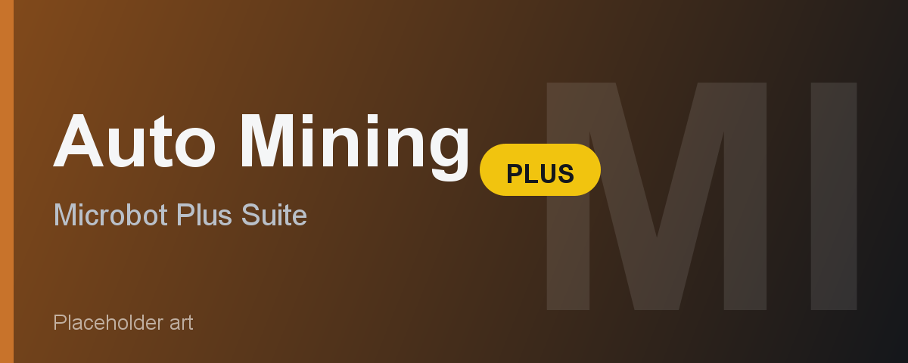

# Auto Mining Plus

Auto Mining Plus automates ore mining and banking across a wide range of OSRS mines. You pick the ore and the mine - or let AUTO_BEST walk you to the closest accessible spot - and the bot handles the rest: walking there, mining until full, banking or dropping, and looping. It is part of the Microbot "Plus" suite of skilling plugins and is fully F2P friendly for the ores and mines available to free players.

---

## Feature Overview

| Feature | Description |
|---------|-------------|
| **Ore selection** | Choose from Tin, Copper, Clay, Iron, Silver, Coal, Gold, Gem, Mithril, Adamantite, Basalt, Urt/Efh/Te salts, or Runite. |
| **Mine location picker** | Select from 20 named mines or use AUTO_BEST to walk to the closest accessible mine for the chosen ore. |
| **Progressive mode** | Automatically upgrades to the best ore your Mining level allows as you level up. |
| **Distance to stray** | Limits how far the bot roams from its starting tile (default 20 tiles). |
| **Max players in area** | Hops worlds when more than a set number of other players are nearby. 0 disables the check. |
| **Banking** | Walks to the nearest or a named bank when the inventory fills, then returns to the mine. Disabled by default (drop mode). |
| **Preferred bank** | Choose a specific bank or leave on AUTO_NEAREST to let the bot pick the closest one. |
| **Items to bank** | Comma-separated list of item name fragments to deposit. Defaults to a broad list covering all mineable items. |
| **Clay bracelet** | Withdraws and equips a bracelet of clay each banking trip (start with one in your inventory). |
| **Drop order** | Controls the order ores are dropped when not banking (Standard or custom). |
| **Items to keep** | Items that are never dropped (default: pickaxe). |
| **Stop after (minutes)** | Auto-shuts down after a set runtime. 0 = no limit. |
| **Stop after (XP gained)** | Auto-shuts down after gaining a set amount of Mining XP. 0 = no limit. |
| **Target level** | Banks or drops the current inventory, then stops when Mining reaches this level. 0 = disabled. |
| **Stop after (ores mined)** | Stops after mining a set number of ores (counts one per XP drop). 0 = disabled. |
| **League mode (anti-AFK)** | Periodically presses a key to reset the idle timer and prevent logout. |
| **Speed mode** | Disables cooldowns, micro-breaks, and Bezier mouse paths for faster throughput. Looks more bot-like - use only on throwaway accounts. |
| **Live overlay** | Displays current level (+levels gained), XP gained, XP/hr, ores mined, runtime, target-level progress, and a Pause/Resume button. |

---

## Requirements

- Microbot RuneLite client
- A pickaxe in your inventory or equipped (any tier your Mining level allows)
- F2P friendly - all core ores (Tin through Runite) and most mine locations work on free worlds
- Members-only mines are labelled "(P2P)" in the dropdown and will not be selected by AUTO_BEST on a free world
- Some locations have additional gates:
  - Mining Guild - 60 Mining
  - Crafting Guild - 40 Crafting + brown apron (for Gold, Silver, Clay there)
  - Shilo Village Gem Mine - Shilo Village quest completed (P2P)
  - Heroes' Guild Mine - Heroes' Quest completed (P2P)
  - Neitiznot Mine - The Fremennik Isles quest completed (P2P)
  - Weiss Basalt Mine - Making Friends with My Arm quest completed (P2P)
  - Lava Maze Runite Mine - Wilderness (dangerous; not selected by AUTO_BEST)

---

## How It Works

1. Configure the ore type, mine location, and banking preference in the plugin panel.
2. Stand anywhere in the game world and click Start.
3. The bot walks to the selected mine (or the closest accessible mine if AUTO_BEST is set).
4. It mines the chosen ore until the inventory is full or until no rocks of that type are reachable within the stray distance.
5. If banking is enabled, the bot walks to the preferred bank, deposits the configured items, and walks back to the mine anchor point before resuming.
6. If banking is disabled, the bot drops all inventory items except those listed in "Items to keep", then resumes mining.
7. Steps 3 to 6 repeat until a stop condition is reached (runtime, XP, target level, ore count) or you press Pause or disable the plugin.

---

## Configuration

**Ore and location:** Start by setting the Ore dropdown to what you want to mine. Set Mine location to the specific mine you want or leave it on AUTO_BEST. AUTO_BEST measures raw coordinate distance and picks the closest mine that holds your chosen ore and that you have access to. Note that AUTO_BEST does not work well with underground mines like the Mining Guild or Dwarven Mine after a surface bank trip - if you want those, select them explicitly.

**Banking vs. dropping:** Enable UseBank if you want to keep the ores. Leave it off to power-mine (drop everything). With banking on, set Preferred bank if the auto-nearest pick is not ideal - for example, Al Kharid Mine miners may prefer Al Kharid Arena bank over the default south-city bank.

**Items to bank:** The default list covers all standard mineables by name fragment. You only need to change this if you are mining something unusual or want to deposit additional items like gems.

**Basalt:** Enable UseBank - the bot will automatically note basalt at Snowflake in Weiss.

**Stop conditions:** Set any combination of Stop after minutes, Stop after XP, Target level, and Stop after ores to cap a session. All default to 0 (no limit).

---

## Limitations

- AUTO_BEST uses raw coordinate distance and cannot account for Wilderness danger at the Lava Maze Runite Mine or for toll gates like the Al Kharid gate. Pick those locations explicitly.
- Underground mines (Mining Guild, Dwarven Mine) read as thousands of tiles away from a surface bank due to plane offsets, so AUTO_BEST always prefers a surface mine after banking. Select them explicitly for consistent underground sessions.
- Gem rocks are only available at Shilo Village (P2P, quest-gated). No F2P gem rock location is supported.
- Salts (Urt, Efh, Te) and Basalt are available only at Weiss (P2P, quest-gated).
- Runite mining at the Lava Maze is in the Wilderness - the bot will not protect you from PKers.
- The Edgeville Dungeon Mine is F2P but is surrounded by aggressive monsters and is far from a bank; it is included for completeness but is rarely efficient.
