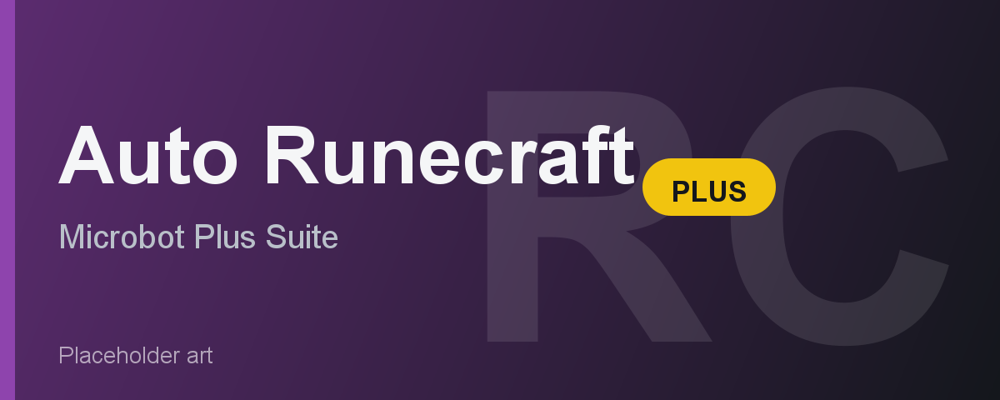

# Auto Runecraft Plus

Auto Runecraft Plus runs essence to a runecrafting altar and crafts runes on a continuous loop: bank, walk to the altar, enter, craft, exit, repeat. It supports F2P altars out of the box and is part of the Microbot "Plus" suite, which adds stop conditions, a live stats overlay, a Pause button, speed mode, and league anti-AFK to any skill grind.

---

## Feature Overview

| Feature | Description |
|---------|-------------|
| **Altar picker** | Choose from Air, Earth, Water, Fire, Body (all F2P), or Nature (members). |
| **Essence type** | Craft with Rune, Pure, or Daeyalt essence. Pure and Rune give identical XP; pick by cost. Daeyalt gives +50% XP but is members-only. |
| **Pouch support** | Fills and empties essence pouches each trip to carry more essence per run. Members-only. |
| **Pouch repair** | Repairs degraded pouches via NPC Contact if you are on the Lunar spellbook. Members-only. |
| **Combination runes** | Crafts mist, dust, mud, smoke, steam, or lava runes using the binding-necklace method. The bot carries pure essence plus the secondary element's runes and talisman, wears a binding necklace for a guaranteed bind, and swaps in a fresh necklace when the worn one crumbles. Members-only. |
| **Stop after (minutes)** | Auto-shuts down after the set number of runtime minutes. 0 disables the limit. |
| **Stop after (XP gained)** | Auto-shuts down after gaining the set amount of Runecraft XP. 0 disables the limit. |
| **Target level** | Stops when your Runecraft level reaches the target, banking the inventory first for a clean exit. 0 disables. |
| **League mode (anti-AFK)** | Periodically presses an arrow key to reset the idle-logout timer. |
| **Speed mode** | Disables Microbot antiban for a faster, more detectable pace. Throwaway accounts only. |
| **Live overlay** | Shows current Runecraft level (with level delta), XP gained, XP/hr, trip count, and runtime. Includes a clickable Pause/Resume button. |

---

## Requirements

- Microbot RuneLite client
- A talisman or tiara for your chosen altar in the bank
- Essence of the chosen type in the bank
- F2P friendly for Air, Earth, Water, Fire, and Body altars
- Members account required for: Nature altar, pouch use, pouch repair (Lunar spellbook + NPC Contact), Daeyalt essence (Sins of the Father quest + access to the Darkmeyer daeyalt mine), and combination runes (binding necklaces + secondary runes and talismans in the bank)

---

## How It Works

1. Configure the altar, essence type, and any optional features in the plugin panel, then enable the plugin.
2. The bot checks your inventory and bank. If it is missing your talisman/tiara or essence, it routes to the nearest bank first.
3. It withdraws the talisman or equips the tiara, fills the inventory (and pouches if enabled) with essence, then walks to the altar ruins.
4. It enters the altar using the talisman or tiara, crafts all carried essence into runes, then exits through the portal.
5. If pouches are enabled and one is degraded, it casts NPC Contact to repair via the Dark Mage (Lunar spellbook required).
6. It banks the runes, refills essence, and repeats. Stop conditions are checked each trip.

---

## Configuration

Set **Altar** to the altar you want to train at. Air, Earth, Water, Fire, and Body run in F2P; Nature requires a members account.

Set **Essence** to match what you have banked. Rune and Pure give the same XP per essence - use whichever is cheaper. Daeyalt gives 50% more XP per piece but must be self-mined (members content).

Enable **Use pouches** if you have essence pouches banked and want to carry more essence per trip. The bot fills them at the bank and empties them at the altar. If a pouch degrades, the bot repairs it automatically provided you are on the Lunar spellbook.

Use the three **stop conditions** - Stop after (minutes), Stop after (XP gained), and Target level - to schedule unattended sessions with a defined endpoint. Setting all three to 0 runs indefinitely.

### Combination runes

Open the **Combo runes** section and set **Combo rune** to the combination rune you want. Leave it on None for normal single-rune crafting. When set, the bot ignores the Altar picker, walks to the correct element altar, and binds the combo rune. Keep these in your bank:

- Pure essence
- The secondary element's runes (one per essence)
- The secondary element's talisman (one is consumed per altar trip)
- A stack of binding necklaces

Recipes and level requirements (members):

| Combo rune | Level | Altar | Carry |
|------------|-------|-------|-------|
| Mist | 6 | Air | Water runes + Water talisman |
| Dust | 10 | Earth | Air runes + Air talisman |
| Mud | 13 | Earth | Water runes + Water talisman |
| Smoke | 15 | Fire | Air runes + Air talisman |
| Steam | 19 | Fire | Water runes + Water talisman |
| Lava | 23 | Fire | Earth runes + Earth talisman |

The worn binding necklace guarantees every bind succeeds and lasts 16 altar trips before it crumbles. Set **Spare necklaces** to how many extras to keep in the inventory so the bot can swap in a fresh one without a bank trip. Pouches are turned off automatically in combo mode so essence and the secondary runes stay matched one to one.

---

## Limitations

- Supported altars are Air, Earth, Water, Fire, Body, and Nature only. Cosmic, Chaos, Law, Death, and others are not implemented.
- Combination runes cover mist, dust, mud, smoke, steam, and lava (the combos craftable at the Air, Earth, Water, and Fire altars). They are members-only and need the level shown in the table above.
- GOTR, Ourania/ZMI, Abyss, Astral, and Arceuus blood/soul runecrafting are separate Hub plugins and are not covered here.
- Pouch filling and repair require a members account. Repair additionally requires the Lunar spellbook and completion of the Lunar Diplomacy quest chain.
- Daeyalt essence requires a members account and completion of Sins of the Father.
- The Magic Imbue method (binding combos without a talisman) is not implemented yet; the bot uses the binding-necklace method only.
